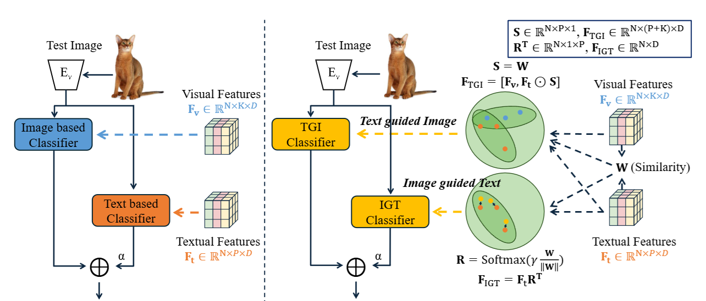

# TIMO

Official Pytorch Implementation of [TIMO](https://arxiv.org/abs/2412.11375) - Text and Image Are Mutually Beneficial: Enhancing Training-Free Few-Shot Classification with CLIP.

## Description

TIMO (Text-Image Mutual guidance Optimization) is a novel approach for training-free few-shot learning that addresses key limitations in existing CLIP-based methods. 

Contrastive Language-Image Pretraining (CLIP) has demonstrated promising performance in few-shot learning (FSL). However, existing CLIP-based methods in training-free FSL mainly learn different modalities independently, leading to two essential issues:

1. **Severe anomalous match in image modality**
2. **Varying quality of generated text prompts**

To address these issues, TIMO builds a mutual guidance mechanism with two key components:

- **Image-Guided-Text (IGT)**: Rectifies varying quality of text prompts through image representations
- **Text-Guided-Image (TGI)**: Mitigates the anomalous match of image modality through text representations

By integrating IGT and TGI, TIMO adopts a perspective of Text-Image Mutual guidance Optimization. Extensive experiments show that TIMO significantly outperforms the state-of-the-art (SOTA) training-free method. Additionally, by exploring the extent of mutual guidance, we propose an enhanced variant, **TIMO-S**, which even surpasses the best training-required methods by 0.33% with approximately ×100 less time cost.

<div align="center">
  
</div>

## Citation

```
@article{Li_2024_Text,
  title={Text and Image Are Mutually Beneficial: Enhancing Training-Free Few-Shot Classification with CLIP},
  author={Li, Yayuan and Guo, Jintao and Qi, Lei and Li, Wenbin and Shi, Yinghuan},
  journal={arXiv preprint arXiv:2412.11375},
  year={2024}
}
```